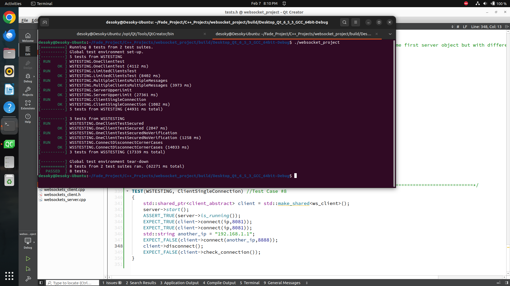

# websockets-server-client
A simple, high-performance, scalable, and secure WebSocket client-server module in C++.
🔹 Project Overview
This module allows developers to establish both secure (WSS) and non-secure (WS) WebSocket servers, handling multiple concurrent clients efficiently, as well as establishing connections as clients.
Providing 3 types of communications:
1️⃣WebSocket.
2️⃣WebSocket Secure with only Key Exchange.
3️⃣WebSocket Secure with Key Exchange and mutual digital certificate verification.

🔹 Software Design
I aimed for a modular and maintainable design using OOP and SOLID design principles. Also I used some design patterns, such as:
✅ Singleton: To limit creating more than one server instance of a specific type using a static factory method.
✅ Facade: To Simplify user interaction by abstracting complex WebSocket operations.
📌 Module contains 3 parts:
1️⃣ Client classes: Used for client side requests and operations.
.png)
**Client classes hierarchy**

2️⃣ Server classes: For full control over server, accepting connections, receiving and sending messages through ongoing sessions.
3️⃣ Session classes: Client counterpart at servers side. accessed only by server classes to read and respond to clients through started sessions.
.png)
.png)
**Server and Session classes hierarchy**

🔹 Key Features & Functionality
🚀 Asynchronous Operations: I used Boost.Asio’s async functionalities for asynchronous read and write operations and handshaking.
📫 Message Queuing System: Messages are stored in a queue. user can check the queue and read from it.
🔒SSL/TLS Security: Secure communications using SSL/TLS layer provided by Boost libraries and using generated certificates and keys by OpenSSL.
🔀Threads Pool for Concurrent Handling: Each connection is handled by 2 threads at each side, client/server. For reading and writing ensuring smooth performance.
🚦 Thread-Safety: Shared resources and critical sections are protected by mutexes. To ensure safe read/write operations and connection control across multiple threads.
🔄 Resource Management: To prevent memory leakage using smart pointers. also some cases needed explicit release of memory for errors handling and cleanup.
.png)
**client-server sequence diagram**
.png)
**thread-safe read/write sequence diagram**
.png)
**thread-safe server session establishment sequence diagram**
.png)
**complete websocket secure sequence diagram**

🔹 Testing & Validation
To ensure the reliability of the module, I designed a set of test cases and implemented them using Google Test (GTest).
✅ Unit Testing: Verified the functionaility of individual components, including WebSocket connection handling, message queuing, and SSL/TLS security.
✅ Negative Testing: Simulated failure scenarios such as dropped connections and unreachable servers.

**GTest testing results**

## External Dependencies
  * Boost.Asio library
  * Boost.Beast library
  * gtest library
  * openssl for key and certificates creation.

Huge thanks to Umar Lone for his Modern C++ course, which played a significant role in refining my understanding of C++ best practices and modern features. Highly recommend his course to anyone looking to master Modern C++!
